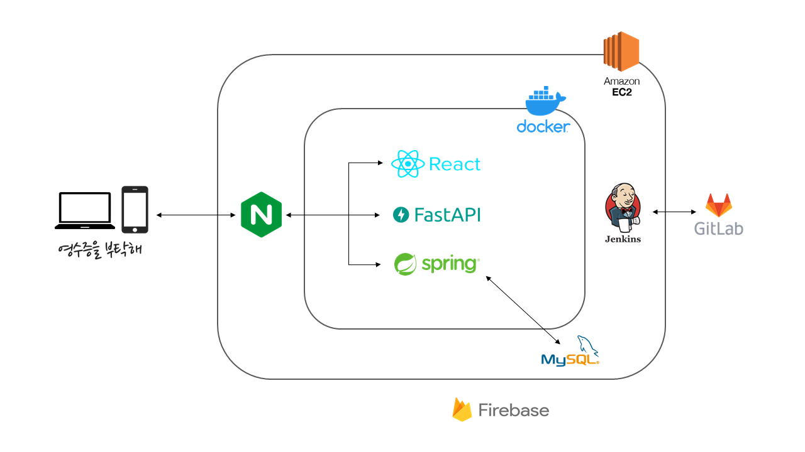
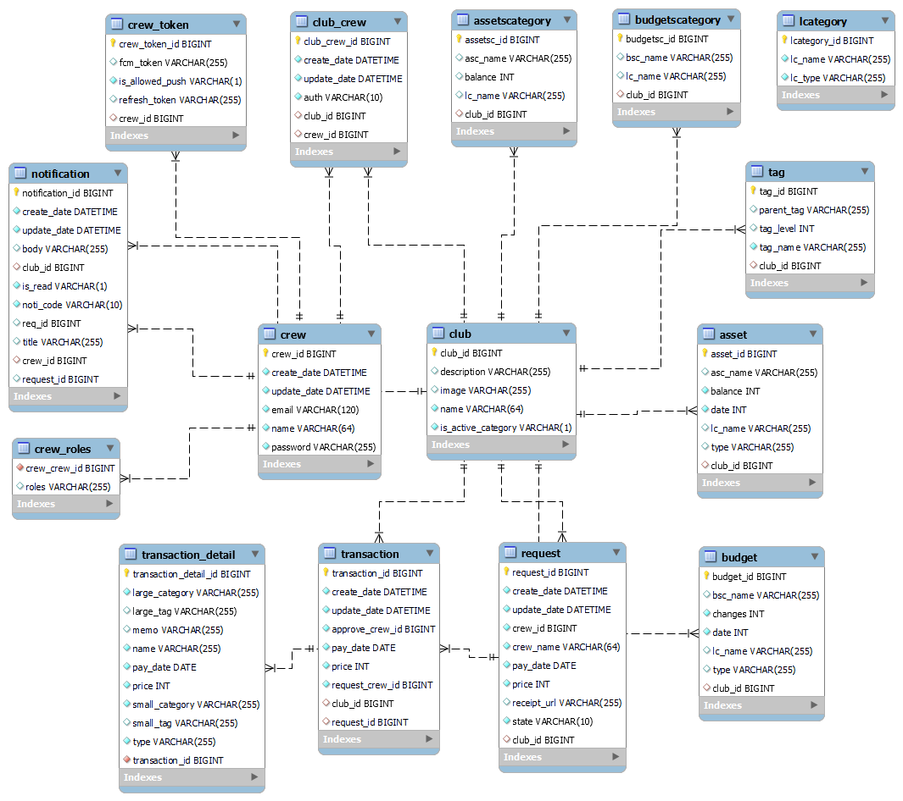
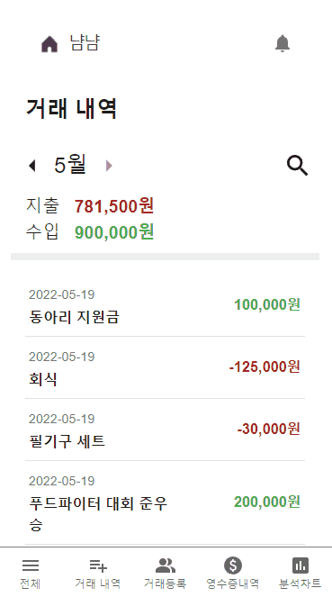
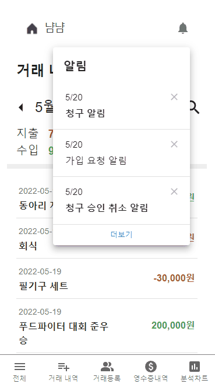
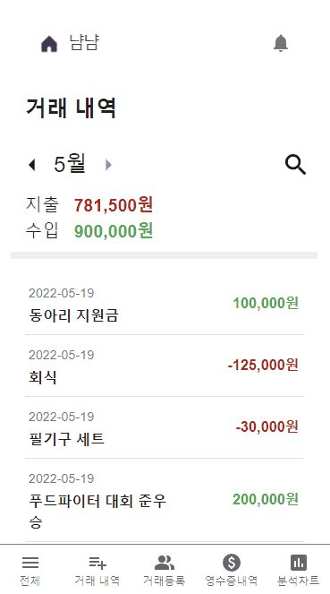
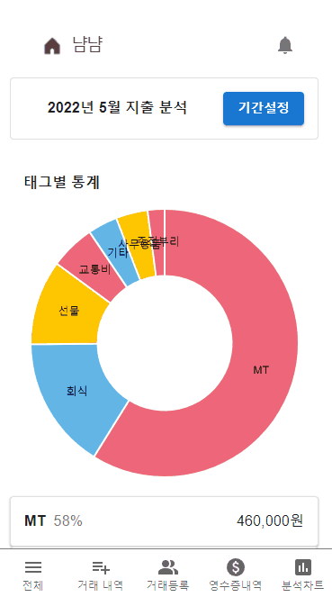
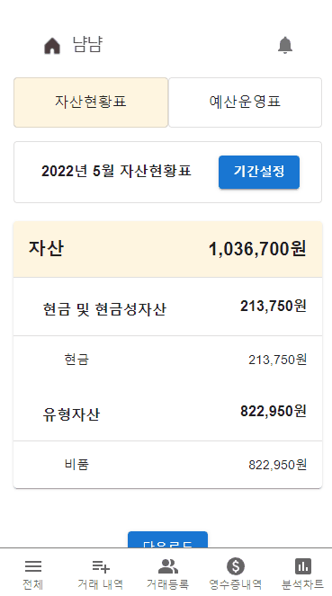
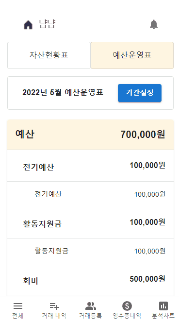
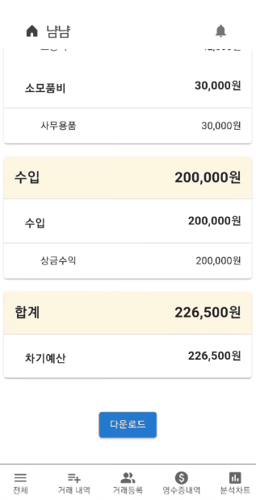

# 🧾 영수증을 부탁해 

> 소규모 모임을 위한 영수증 및 회계 관리 서비스

## 🎇 프로젝트 소개

#### 📅 진행 기간 

- 2022.04.11 ~ 2022.05.20 (6주)

#### 🧐 기획 의도

모든 모임은 회계 관리에 대한 니즈가 있습니다. 하지만 회계 관리를 투명하게 관리하기란 쉽지 않습니다. 총무는 회원들에게 일일이 영수증을 받으러 다녀야하고, 이렇게 얻은 실물 영수증은 누락, 분실 등의 위험이 존재하기 때문입니다. 또한 모임 장부는 총무 개인이 관리하는 경우가 많아 회원들이 실시간으로 확인하기는 어렵습니다. 뿐만 아니라 회계에 대한 전문 지식이 없는 회원이 총무를 담당하게 될 경우에는 보고서 작성에 어려움을 겪기도 합니다. 

영수증을 부탁해는 이러한 불편함을 겪는 소모임들을 대상으로 **복잡한 회계 서비스를 단순하고 직관적으로 제공**하기 위해 기획되었습니다.

#### 🎯 타겟

- 거래 내역을 편리하게 관리하고 싶은 총무
- 회계를 잘 모르지만 총무를 맡게 된 회원
- 매번 총무에게 장부를 보여달라고 하기 민망한 회원

#### ⚙️ 주요 기능

| **기능**            | **설명**                                                     |
| ------------------- | ------------------------------------------------------------ |
| **영수증 등록**     | 총무에게 직접 영수증을 건넬 필요 없이, 모바일 환경에서 쉽게 영수증을 등록할 수 있습니다. |
| **영수증 OCR 인식** | 영수증을 등록하는 과정에서 AI가 거래 날짜와 총액을 인식하여 자동 입력해줍니다. |
| **거래 등록**       | 영수증을 기반으로 거래 상세 내역을 등록하여 관리할 수 있습니다. |
| **거래 내역 검색**  | 등록된 거래 내역을 날짜 및 태그로 검색할 수 있습니다.        |
| **지출 분석**       | 항목별 분석, 시계열 분석을 통해 지출 내역을 차트로 한 눈에 확인할 수 있습니다. |
| **보고서 확인**     | 보고를 위한 월별 자산현황표, 예산운영표를 자동으로 생성해주며, 생성된 보고서는 Excel 파일로 다운로드 받아 활용할 수 있습니다. |
| **푸시 알림**       | 요청이 등록 및 처리될 때마다 푸시 알림을 보내주어, 요청 현황을 실시간으로 확인할 수 있습니다. |

## ⛑ 아키텍처

## 🛠️ 기술 스택

#### 💻 프론트엔드

   

   

#### 🛢 백엔드

   

 

#### 📡 인프라

   

## 🗃 ERD

## 💡 사용 예시

1. **메인 화면**

   

   - 서비스 소개 및 주요 기능 설명을 확인할 수 있습니다.

2. **모임 가입 신청**

   

   - 모임을 검색하고, 원하는 모임에 가입 신청을 할 수 있습니다.

3. **모임 가입 승인**

   

   - 모임 리더는 가입 신청 내역을 확인하고 승인 또는 거부할 수 있습니다.

4. **영수증 등록**

   

   - 영수증 사진, 날짜, 총금액을 입력하여 영수증 청구 요청을 할 수 있습니다.
   - 영수증 사진을 등록할 때, AI를 통해 영수증이 분석되며 자동으로 날짜와 총금액이 입력됩니다.

5. **거래 등록** 

   

   - 요청된 영수증 내역을 바탕으로 세부 내용을 적어 거래 등록을 할 수 있습니다.
   - 입력한 계정과목 대분류와 소분류는 보고서 작성에, 태그는 분석 차트에 사용됩니다.

6. **거래 내역 검색**

   

   - 거래 내역을 내용, 태그를 기반으로 검색할 수 있습니다.

7. **지출 분석** 

   

   - 월별로 모임이 지출한 내역들의 분석 결과를 차트로 확인할 수 있습니다.

8. **자산현황표**

   

   - 월별 자산현황표를 확인할 수 있습니다. 

9. **예산운영표**

   

   - 월별 예산운영표를 확인할 수 있습니다. 

10. **보고서 다운로드**

    

    - 보고서는 Excel 파일로 저장하여 활용할 수 있습니다.

## 🐱‍💻 팀 소개

| 팀원     | 담당                      | GitHub                                           |
| -------- | ------------------------- | ------------------------------------------------ |
| 서지원 👑 | 인공지능 및 백엔드 개발   | [@seojiwon0702](https://github.com/seojiwon0702) |
| 서상용   | 프론트엔드 개발           | [@ssy0061](https://github.com/ssy0061)           |
| 이우영   | 프론트엔드 개발, UCC 편집 | [@ujumom](https://github.com/ujumom)             |
| 양아름   | 백엔드 개발               | [@yeveyn](https://github.com/yeveyn)             |
| 신인호   | 프론트엔드 개발           | [@adiens916](https://github.com/adiens916)       |
| 조태연   | 프론트엔드 개발           | [@charleyCho](https://github.com/charleyCho)     |

 
Git 컨벤션
 

  **branch 생성 규칙**

- 모든 기능은 develop 브랜치에서 새 브랜치를 생성하여 작업

- feature/[지라 키]-[지라 이슈 번호] 로 브랜치 생성

    

**commit 생성 규칙**

- **feat** : 새로운 기능 추가
- **fix** : 버그를 고친 경우
- design : CSS 등 사용자 UI 디자인 변경
- hotfix : 신속하게 치명적인 버그를 고쳐야 할 경우
- style : 코드 포맷변경, 세미 콜론 누락, 코드 수정 X 경우
- refactor : 프로덕션 코드 리팩토링
- comment : 필요한 주석 추가 및 변경
- **docs** : 문서를 수정한 경우
- rename : 파일, 폴더명 수정이나 이동
- remove : 파일 삭제
- **study** : 학습

 

 
Jira 컨벤션
 
   

- 스프린트
  - 스프린트는 1주일 단위로 진행한다.
  - 스프린트마다 개인당 40 스토리 포인트를 가진다. (1sp ==1시간)
- 에픽
  - 매주 월요일 오전 스크럼 미팅 때 어떤 에픽을 생성할지 논의한다.
  - 태그[]는 기획, 개발 등 완전히 다른 업무를 기준으로 나눈다
  - 해당 태그 내에서 기능별, 업무별 또는 페이지별로 다시 한번 나눈다.
  - ex) [기획] 프로젝트 계획서, [개발] 유저관리, [사전학습] 코틀린
- 스토리
  - 개발 에픽의 경우 MO, BE 등 도메인별 태그와 상세 구현 내용 기입
  - [개발] 유저관리 에픽의 하위 스토리의 경우 ex) [BE] 회원가입 기능
  - [사전학습] 코틀린 에픽의 하위 스토리의 경우 ex) 1~10강 학습

 

 
개발 환경
 

## **Development Environment**

- 작성 날짜: 2022-05-20
- CPU: Intel(R) Core(TM) i7-9750H CPU @ 2.60GHz RAM: 16.0 GB
- Ubuntu: 20.04 LTS (GNU/Linux 5.4.0-1018-aws x68_64)
  - Docker: 20.10.12
  - Docker Compose: 2.1.0
  - Nginx: 1.18.0
- Backend
  - Java JDK: v17.0.2
  - Spring: 2.6.7
  - Mysql: 8.0.27
  - Intellij: 2021.3.1
- Backend (AI)
  - Python
  - FastAPI
  - Pycharm
- Frontend (Web)
  - React: 18.1.0
  - Typescript: 4.6.3
  - Visual Studio Code: 1.67.0
- Frontend (Android)
  - Kotlin: 1.6.10
  - Android Studio: 2021.1.1
  - Android Gradle: 7.0.4

# **Port**

- Nginx: 80
- Spring Boot: 8185
- FastAPI: 5555
- React: 3000
- jenkins: 8000

 

## 📎 서비스 이용

[포팅 매뉴얼](https://lab.ssafy.com/s06-final/S06P31D104/-/blob/develop/exec/portingmanual.md)

[웹 사이트](https://k6d104.p.ssafy.io/)

[앱 다운로드](keep-my-receipt.apk)
