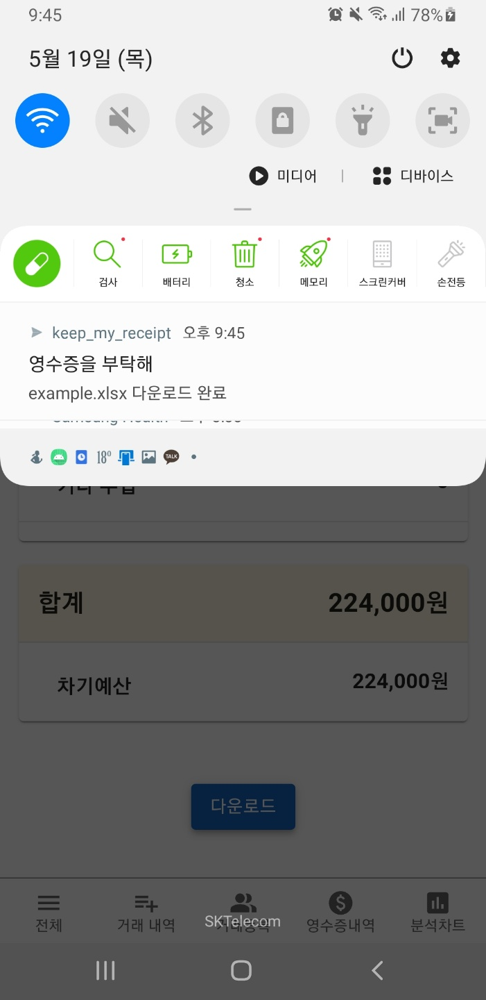

### 0. 랜딩 페이지

---

- "영수증을 부탁해" 의 핵심 기능을 확인할 수 있는 페이지

---

### 1. 모임 검색

---

- 전체 모임

---

### 2. 모임 목록

---

- 가입한 모임

---

### 3. 가입 대기 모임 목록

---

- 가입 대기 중인 모임

---

### 4. 모임 만들기

---

- 모임 생성 -> 모임 목록

---

### 5. 거래 내역(간략히 소개)

---

- 최상단 왕관은 자신이 이 모임의 리더라는 것을 의미

---

### 6. 영수증 등록

---

- 시연용 영수증***
- 영수증 등록 시 앱으로 요청 알림이 들어오는 것까지 보여주기

---

---

---

### 7. 알림 아이콘 및 알림 페이지

---

- 영수증 등록 시 알림 아이콘 및 알림 페이지 갱신

---

### 8. 영수증 요청 목록

---

- 알림 페이지와 영수증 요청 목록 페이지에서 영수증 승인하는 페이지로 들어갈 수 있다.

---

### 9. 영수증 승인

---

- 영수층이 청구되면 관리자 이상의 멤버는 청구된 영수증을 승인할 수 있다.

---

### 10. 거래 등록

---

- 승인된 영수증 혹은 영수증 없이 거래를 등록할 수 있다.

---

### 11. 거래 내역

---

---

### 12. 거래 상세 페이지 (수정 및 삭제)

---

- 거래가 등록되면 해당 상세 페이지에서 확인, 수정, 삭제할 수 있다.

---

### 13. 분석 차트

---

- 태그 분석 차트와 시계열 분석 차트

---

---

---

### 14. 보고서

---

- 자산현황표와 예산운영표

---

---

---

### 15. 보고서 다운로드 -> 앱 알림 -> 액셀 실행

---

---

---

---

### 16. 모임 관리

---

---

### 17. 새로운 멤버 가입 신청 시 알림

---

- 영수증 청구 외에도 새로운 멤버 가입 신청 시 관리자 이상의 멤버에게 알림이 온다.

### 18. 모임에 가입 신청한 회원 목록

---

---

### 19. 설정 페이지

---

- 설정 페이지에선 알림 설정, 정보 수정, 회원 탈퇴, 로그아웃 등을 할 수 있다.

---

