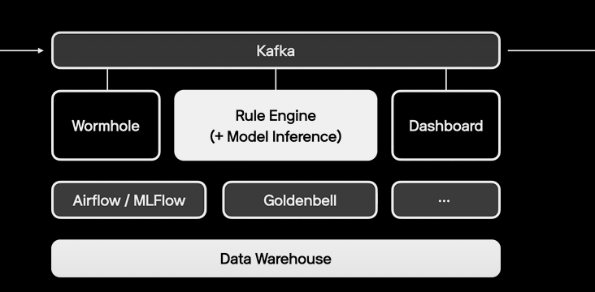

# FDS

### FDS의 4가지 핵심 기능

> 1. 정보수집
>
>    이상 금융거래 탐지의 정확성을 위해
>    크게 이용자 매체 환경 정보와 유형 정보를 수집
>
> 2. **분석 및 탐지**
>
>    수집된 정보는 이용자 및 거래 유형별 다양한 상관관계 분석
>    및 규칙 검사 등을 통해 이상 행위를 탐지
>
> 3. 대응 기능
>
>    분석된 이상 거래 행위에 대한 거래 차단 등의 대응.
>
> 4. 모니터링
>
>    수집, 분석 및 대응 등의 종합적인 절차를 통합하여 관리하는 모니터링
>
> 출처: [https://bitnine.tistory.com/m/397](https://bitnine.tistory.com/m/397)

### FDS 모니터링 시스템 구현

> 예시: 카카오페이
>
> - 동시성 : [Kafka](https://ko.wikipedia.org/wiki/%EC%95%84%ED%8C%8C%EC%B9%98_%EC%B9%B4%ED%94%84%EC%B9%B4) / [Akka](https://ko.wikipedia.org/wiki/Akka)
> - 확장성 : [Akka Cluster](https://doc.akka.io/docs/akka/current/typed/cluster-concepts.html#introduction) / [k8s](https://ko.wikipedia.org/wiki/%EC%BF%A0%EB%B2%84%EB%84%A4%ED%8B%B0%EC%8A%A4)
> - 실시간성 : [Redis](https://ko.wikipedia.org/wiki/%EB%A0%88%EB%94%94%EC%8A%A4) / [Druid](https://ko.wikipedia.org/wiki/%EC%95%84%ED%8C%8C%EC%B9%98_%EB%93%9C%EB%A3%A8%EC%9D%B4%EB%93%9C) / [Kudu](https://ko.wikipedia.org/wiki/%EC%95%84%ED%8C%8C%EC%B9%98_%EC%BF%A0%EB%91%90)
>
> 특히 Akka는 유연하고 기민한 대처 가능
>
> 
>
> 실시간으로 쏟아지는 데이터 속에서 rule 방식, ML, DL 모델을 통해 감시 가능케 하고,
> 이러한 감시 통계데이터를 실시간으로 확인할 수 있도록 risk management system을 구축
>
> 출처: [https://velog.io/@kiki\_/이상거래탐지를-위한-실시간데이터-처리와-금융사기-행동-분석](https://velog.io/@kiki_/%EC%9D%B4%EC%83%81%EA%B1%B0%EB%9E%98%ED%83%90%EC%A7%80%EB%A5%BC-%EC%9C%84%ED%95%9C-%EC%8B%A4%EC%8B%9C%EA%B0%84%EB%8D%B0%EC%9D%B4%ED%84%B0-%EC%B2%98%EB%A6%AC%EC%99%80-%EA%B8%88%EC%9C%B5%EC%82%AC%EA%B8%B0-%ED%96%89%EB%8F%99-%EB%B6%84%EC%84%9D)

## 분석 및 탐지

> FDS의 분석 탐지 방법은 기본적으로 범죄에 악용이 될 수 있기에 회사마다 1급 비밀로 분류하고 있습니다. 기본적으로는 다음의 정보를 활용해 분석 및 탐지가 진행됩니다.
>
> 1. **위치정보를 통한 이상 거래 진단**
> 2. **고객정보와 평소 거래 패턴 분석**
> 3. **고객 접속 환경 정보 분석**
> 4. **기존 통계 데이터를 활용한 위험도 측정**
>
> 출처: [https://bitnine.tistory.com/m/397](https://bitnine.tistory.com/m/397)

### 기본적인 방법 - Outlier Detection

> Anomaly detection aims to identify **events that lie outside an expected range** and, therefore, might indicate suspicious activity. In the context of a web application, these types of events might indicate fraudsters performing a malicious attack.
>
> For example, the banking industry commonly uses this method to prevent debit card fraud. Suppose you shop at a local grocery store in New York every week for a year. Then, one day, your bank receives several requests for payments made in Central Europe. **This data doesn’t fit in with your previous behavior**, so your bank might send you a verification email or SMS to ensure the anomaly isn’t fraudulent activity.
>
> 출처: [https://fingerprintjs.com/blog/github-projects-fraud-prevention/](https://fingerprintjs.com/blog/github-projects-fraud-prevention/)

활용 가능 오픈소스: **[PyOD](https://github.com/yzhao062/pyod)**

> PyOD is a Python toolkit for performing anomaly detection in your app based on many different data inputs. It includes linear, proximity-based, probabilistic, and neural network models so you can pick the method that works best for your use case. **It requires a pretty fluent knowledge of machine learning algorithms** but includes links to many good resources on the topic if you’re unfamiliar with them.
>
> 
>
> 출처: [https://fingerprintjs.com/blog/github-projects-fraud-prevention/](https://fingerprintjs.com/blog/github-projects-fraud-prevention/)

### 관계(Relation) 관점에서의 데이터 분석

> 비슷한 성향을 갖는 사람들끼리의 관계를 통해,
> 단일 유저만으로 파악할 수 없던 것들을 알아낼 수 있을 것이라 생각
>
> Graph Network 활용
>
> 
>
> 
>
> 출처: [https://velog.io/@kiki\_/이상거래탐지를-위한-실시간데이터-처리와-금융사기-행동-분석](https://velog.io/@kiki_/%EC%9D%B4%EC%83%81%EA%B1%B0%EB%9E%98%ED%83%90%EC%A7%80%EB%A5%BC-%EC%9C%84%ED%95%9C-%EC%8B%A4%EC%8B%9C%EA%B0%84%EB%8D%B0%EC%9D%B4%ED%84%B0-%EC%B2%98%EB%A6%AC%EC%99%80-%EA%B8%88%EC%9C%B5%EC%82%AC%EA%B8%B0-%ED%96%89%EB%8F%99-%EB%B6%84%EC%84%9D)

> 활용 가능한 오픈소스?: **[DGFraud](https://github.com/safe-graph/DGFraud)**
>
> [Graph Neural Networks (GNNs)](https://neptune.ai/blog/graph-neural-network-and-some-of-gnn-applications) have been widely used in recent years as a fraud prevention tool. In this context, DGFraud is GNN based toolbox that will help you identify and prevent malicious users on your app by revealing outliers in user behavior.
>
> 
>
> 출처: [https://fingerprintjs.com/blog/github-projects-fraud-prevention/](https://fingerprintjs.com/blog/github-projects-fraud-prevention/)

### **행적(History) 관점에서의 데이터 분석**

> 어떠한 사람을 파악하기 위해 그사람의 과거 행적을 파악해야 함
>
> **Helix Structure**
>
> 
>
> 
>
> 출처: [https://velog.io/@kiki\_/이상거래탐지를-위한-실시간데이터-처리와-금융사기-행동-분석](https://velog.io/@kiki_/%EC%9D%B4%EC%83%81%EA%B1%B0%EB%9E%98%ED%83%90%EC%A7%80%EB%A5%BC-%EC%9C%84%ED%95%9C-%EC%8B%A4%EC%8B%9C%EA%B0%84%EB%8D%B0%EC%9D%B4%ED%84%B0-%EC%B2%98%EB%A6%AC%EC%99%80-%EA%B8%88%EC%9C%B5%EC%82%AC%EA%B8%B0-%ED%96%89%EB%8F%99-%EB%B6%84%EC%84%9D)
